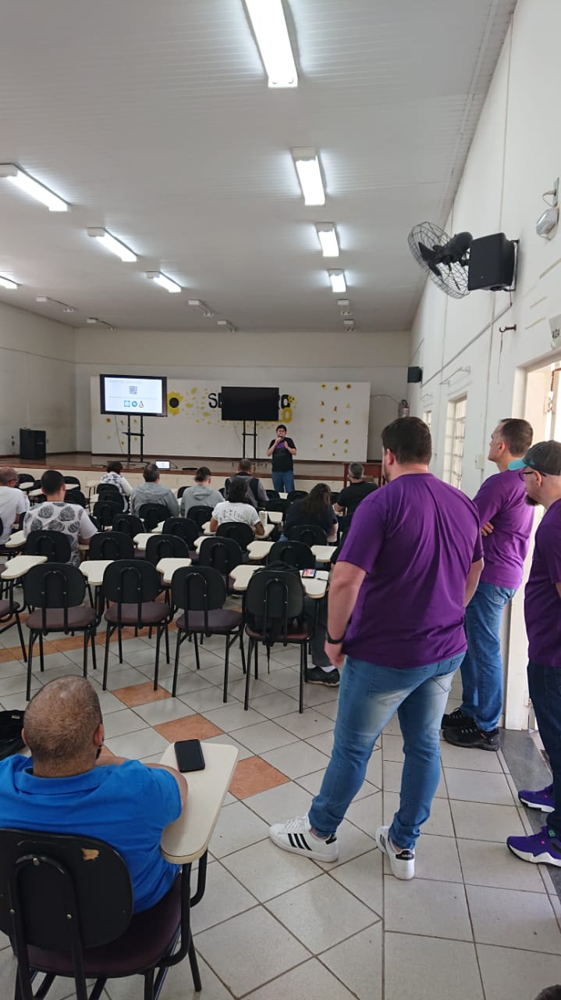
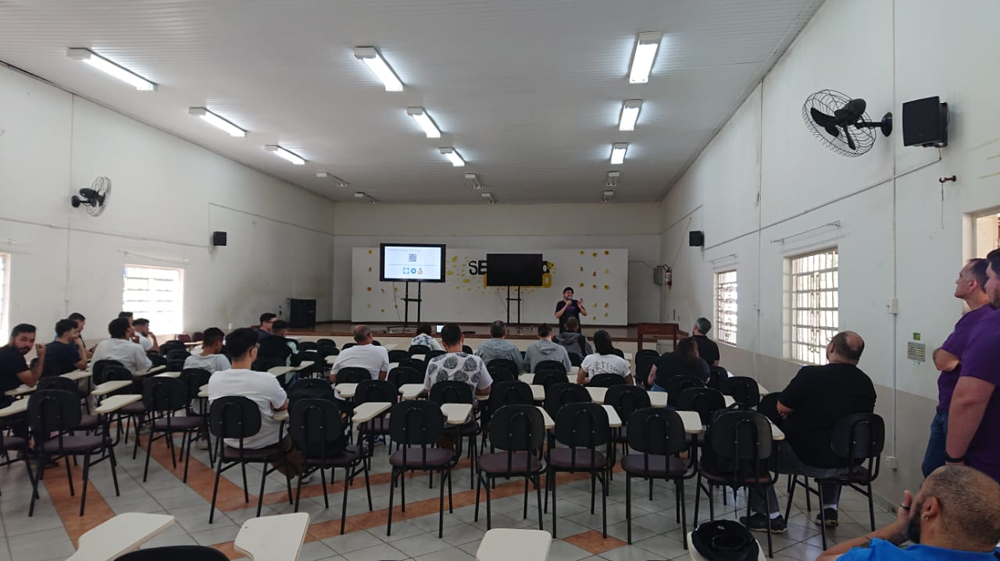
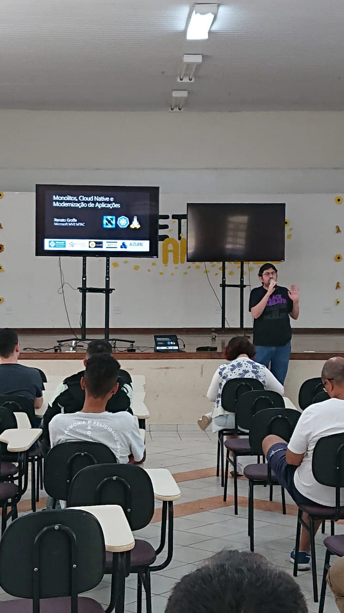
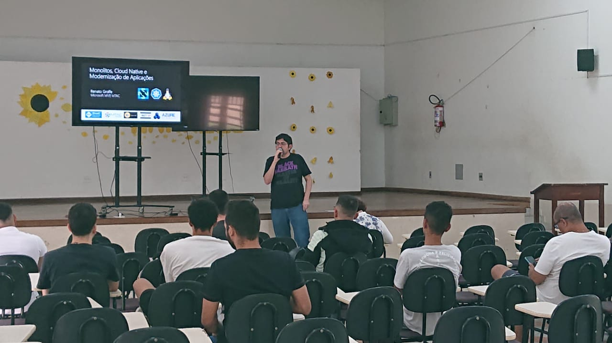

# Monolitos-CloudNative-Modernizacao_ItuDevelopers-2024-09
Conteúdos da apresentação "Monolitos, Cloud Native e Modernização de Aplicações", realizada em evento promovido pela comunidade Itu Developers em 28/09/2024 na cidade de Itu-SP.

---

Título da apresentação: **Monolitos, Cloud Native e Modernização de Aplicações**

Data: **28/09/2024 (sábado)**

Tecnologias e tópicos abordados: **Aplicações Monolíticas, Software legado, Microservices, Containers, Cloud Native, Twelve Factor Apps, CNCF, Kubernetes, Azure Kubernetes Service, Docker, Docker Hub, KEDA, Helm, Terraform, ARM, Bicep, Linux, Git, Azure DevOps, GitHub Actions, DevOps, DevSecOps, .NET, Node.js, Java...**

Número de participantes: **30 pessoas**

Link do evento: [**Meetup**](https://www.meetup.com/itu-developers/events/302936305/)

Deixo aqui meus agradecimentos ao **Marcio Nizzola (Microsoft MVP)**, ao **Renicius Pagotto (Microsoft MVP)**, ao **Thomaz Halter** e à **Letícia Spinardi** por todo o apoio para que eu partipasse como palestrante de mais um evento da comunidade **Itu Developers**.

---

---

Outras fotos podem ser encontrados neste [**diretório**](/img/).
